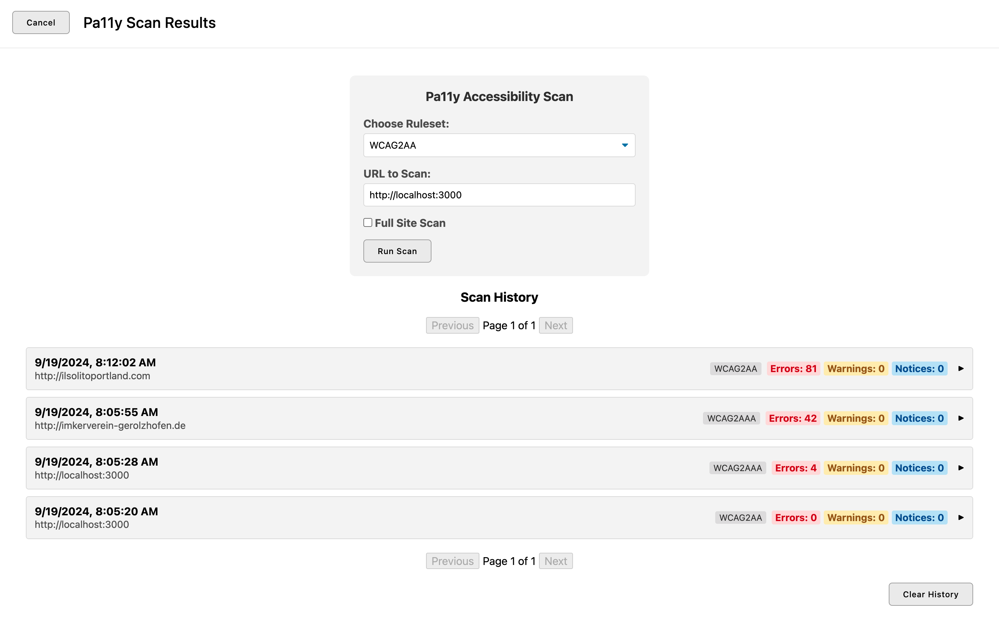

# Pally Extension for ApostropheCMS

Pally Extension is a modern ApostropheCMS module that integrates Pa11y to perform accessibility audits on your website. It provides functionalities to crawl your site, scan pages for accessibility issues, manage scan results, and monitor scan progress — all within the ApostropheCMS admin interface.

## Features

- **Automated Accessibility Scanning**: Utilize Pa11y to detect accessibility issues across your website.
- **Sitemap Parsing & Crawling**: Automatically parse your sitemap or perform link crawling to identify pages to scan.
- **Scan Management**: Start, monitor, and cancel scans directly from the admin dashboard.
- **Result Storage**: Stores scan results in a dedicated MongoDB collection for easy access and management.
- **Admin Dashboard Integration**: Seamlessly integrates with the ApostropheCMS admin bar and modal interfaces.

## Installation

### Steps

1. **Install the Module**

   Use npm to install the Pally Extension module as a dependency in your ApostropheCMS project:

   ```bash
   npm install @bodonkey/pally-extension
   ```

2. **Configure ApostropheCMS to Use the Module**

   In your `app.js` (or equivalent) file, register the Pally Extension module:

   ```javascript
   modules: {
     // ... other modules ...

     '@bodonkey/pally-extension': {
       // Module options can be specified here
     }
   }
   ```

### Additional Setup for Ubuntu, CentOS, & WSL

If you are using WSL, Ubuntu, or CentOS, you will need to install some additional dependencies to ensure Puppeteer (used by Pa11y) runs correctly.

#### WSL

For WSL, follow these steps:

1. **Update Package List**:
   Make sure your package lists are up to date:
   
```bash
sudo apt-get update
```

2. **Installing Required Dependencies**:
   Install the following packages:

```bash
sudo apt install libgtk-3-dev libnotify-dev libgconf-2-4 libnss3 libxss1 libasound2
```

#### Ubuntu

For a standard Ubuntu setup, follow these steps:

1. **Update Package List**:
   Run the following to update your package list:
   ```bash
   sudo apt-get update
   ```

2. **Install Required Dependencies**:
   > Some newer versions of Puppeteer might not need this. Additionally, if you are already using the chromium-browser your system should already have the needed dependencies.

   Install the necessary packages for Chromium and Puppeteer:
   ```bash
   sudo apt install libnss3 libxss1 libatk1.0-0 libatk-bridge2.0-0 libcups2 libdrm2 libgbm1 libxkbcommon0 libxcomposite1 libasound2 libwayland-client0 libwayland-egl1 libwayland-server0 libappindicator3-1 libdbusmenu-glib4 libdbusmenu-gtk3-4
   ```

3. **Install Chromium**:
   Since Puppeteer may not always download the correct version of Chromium, install it manually:
   ```bash
   sudo apt install chromium-browser
   ```

4. **Configure Puppeteer**:
   Point Puppeteer to the installed Chromium:

   Find where the browser is installed:
   ```bash
   $ which chromium-browser
   ```

   ```javascript
   // app.js
   modules: {
     '@bodonkey/pally-extension': {
        options: {
           puppeteer: {
            // Specify the custom Chromium executable path
           // returned from command above
           executablePath: '/usr/bin/chromium-browser'
           }
        }
     }
   }
   ```

#### CentOS

For CentOS, follow these steps:

1. **Update Packages**:
   Ensure your package manager is up-to-date:
   ```bash
   sudo yum update -y
   ```

2. **Install Dependencies**:
   Install required packages to run Chromium and Puppeteer:
   ```bash
   sudo yum install -y libX11 libxkbcommon libXScrnSaver libatk libgtk3 dbus-libs libXtst nss alsa-lib
   ```

3. **Install Chromium**:
   Enable the EPEL (Extra Packages for Enterprise Linux) repository to install Chromium:
   ```bash
   sudo yum install -y epel-release
   sudo yum install -y chromium
   ```

4. **Configure Puppeteer**:
   Similar to Ubuntu, specify the executable path to Chromium for Puppeteer:

   Find where the browser is installed:
   ```bash
   rpm -ql chromium
   ```

   ```javascript
   // app.js
   modules: {
     '@bodonkey/pally-extension': {
        options: {
           puppeteer: {
            // Specify the custom Chromium executable path
           // returned from command above
           executablePath: '/usr/bin/chromium-browser',
            // To resolve sandboxing issues on some servers
           args: ['--no-sandbox', '--disable-setuid-sandbox']
           }
        }
     }
   }
   ```

### Database

When this module is installed, it creates a new collection in your MongoDB called `pa11y-results`. If you uninstall this extension, you will need to delete this collection manually.

## Configuration

Pally Extension offers several configurable options to tailor its behavior to your project's needs. These options can be set in the module configuration within `app.js`.

### Available Options

| Option            | Type    | Default | Description                                                                 |
| ----------------- | ------- | ------- | --------------------------------------------------------------------------- |
| `maxPages`        | Number  | 500      | The maximum number of pages to scan.                                        |
| `includeWarnings` | Boolean | false   | Whether to include warnings in scan results.                                |
| `includeNotices`  | Boolean | false   | Whether to include notices in scan results.                                 |
| `puppeteer`       | Object  | {}      | Puppeteer launch configuration. You can specify any valid Puppeteer options.|

#### Puppeteer Options

The `puppeteer` option allows you to pass custom configuration settings for Puppeteer. This is useful for adjusting settings like the headless mode, specifying a custom Chromium executable path, or adding arguments to Puppeteer.

**Example Configuration:**

```javascript
modules: {
  '@bodonkey/pally-extension': {
    options: {
      maxPages: 10,
      includeWarnings: false,
      includeNotices: false,
      puppeteer: {
        headless: true, // Run in headless mode
        args: ['--no-sandbox', '--disable-setuid-sandbox'], // For environments requiring specific arguments
        executablePath: '/usr/bin/chromium-browser' // Specify a custom Chromium executable path
      }
    }
  }
}
```

## Usage

### Starting a Scan


- Click on the Pally Dashboard icon added to the admin bar.
- Enter the URL of the website you wish to scan (it is pre-populated with the `baseURL` of your site).
- Select the desired ruleset (e.g., `WCAG2AA`).
- Choose between a full scan or a single-page scan.
- Click the "Start Scan" button.

   The scan will begin asynchronously, and progress will be displayed in real-time.

### Cancelling a Scan

- Scanning numerous pages can take a long time. If the scanner follows an undesired link or begins scanning an undesired site, click the cancel scan button below the progress bar.

### Viewing Scan History

- Navigate to the `History` section within the Pally Dashboard to view past scan results.
- Each entry includes details such as the scan date, URL, ruleset used, and the number of errors, warnings, and notices found.

### Clearing Scan History

- Use the clear history button below the scan list to delete all scan records.
- To delete a specific scan record, use the delete button within the scan item.

## Contributing

Contributions are welcome! Please follow these steps to contribute:

1. **Fork the Repository**

2. **Create a Feature Branch**

   ```bash
   git checkout -b feature/YourFeature
   ```

3. **Commit Your Changes**

   ```bash
   git commit -m "Add Your Feature"
   ```

4. **Push to the Branch**

   ```bash
   git push origin feature/YourFeature
   ```

5. **Open a Pull Request**

## License

This project is licensed under the [MIT License](LICENSE).

## Support

For support or questions, please open an issue on the [GitHub repository](https://github.com/@bodonkey/pally-extension).

# Acknowledgements

- [ApostropheCMS](https://apostrophecms.com/)
- [Pa11y](https://pa11y.org/)